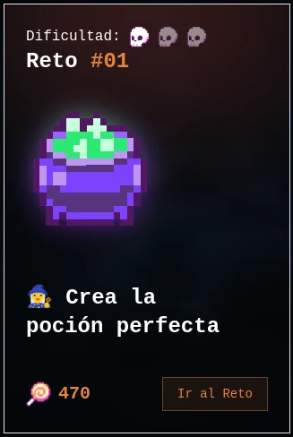
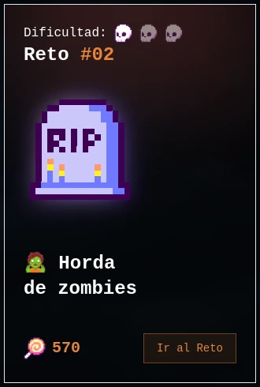
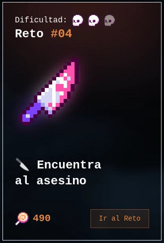

# 🎃 Halloween Dev Challenges 🎃

This repository contains the solutions to the **Halloween Dev** challenges organized by [@midudev](https://midu.dev/). **Halloween Dev** is a special Halloween-inspired programming event designed to test your skills with spooky and fun challenges that celebrate the spirit of the season.

Throughout the event, participants face challenges of varying difficulty, providing opportunities to learn, improve, and enjoy solving creative and eerie problems. Join the fun and explore the solutions to each challenge!

👉 Visit the event website: [Halloween Dev](https://www.halloween.dev/es) 👈

## 🎯 Objective

This repository documents the solutions for each challenge, with the goal of:
- 💡 Sharing knowledge and problem-solving approaches.
- 📈 Helping other developers improve their skills.
- 👻 Keeping the Halloween spirit alive in the world of code.

## 🎃 List of Challenges

### 2024

### Challenge# 1: **Create the Perfect Potion** 🧙‍♂️🍵

👉 📂 [View solution](./2024/challenges/challenge-1.js)
  

---

### Challenge# 2: **Zombie Horde** 🧟‍♂️🪦

👉 📂 [View solution](./2024/challenges/challenge-2.js)
  

---

### Challenge# 3: **Escape Freddy’s Nightmare** 🎃🌌

👉 📂 [View solution](./2024/challenges/challenge-3.js)

---

### Challenge# 4: **Find the Killer** 🔪🩸

👉 📂 [View solution](./2024/challenges/challenge-4.js)

---

### Challenge# 5: **Silent Hill Terror** 👁️🧟‍♂️

👉 📂 [View solution](./2024/challenges/challenge-5.js)

---

## 🧙‍♀️ Contributions

Contributions are welcome 🎉. If you have optimization ideas, improvements to the solutions, or want to add your own versions, feel free to fork this repository and submit a pull request.

---

Enjoy a Halloween full of challenges and coding fun! 👻🎃🕸️
